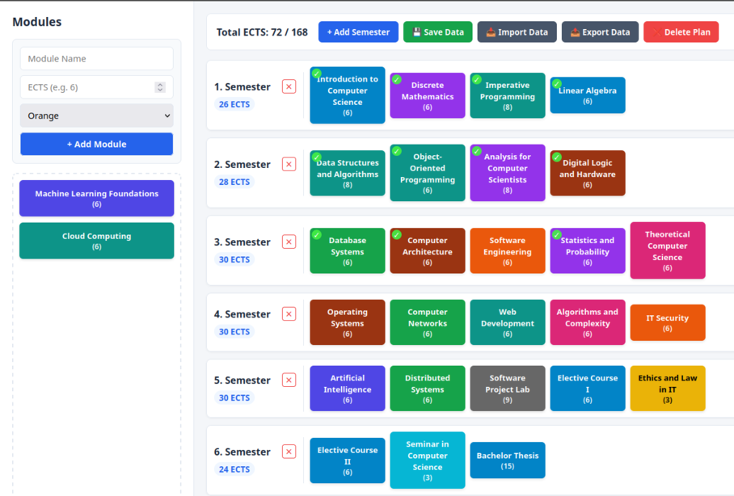

# semesterplanner

A simple python flask website for planning your study curriculum and earned credits.



## How to use
Install the required dependencies with
```
pip install -r requirements.txt
```
then to start the server, simply run
```
python server.py [PORT]
```
